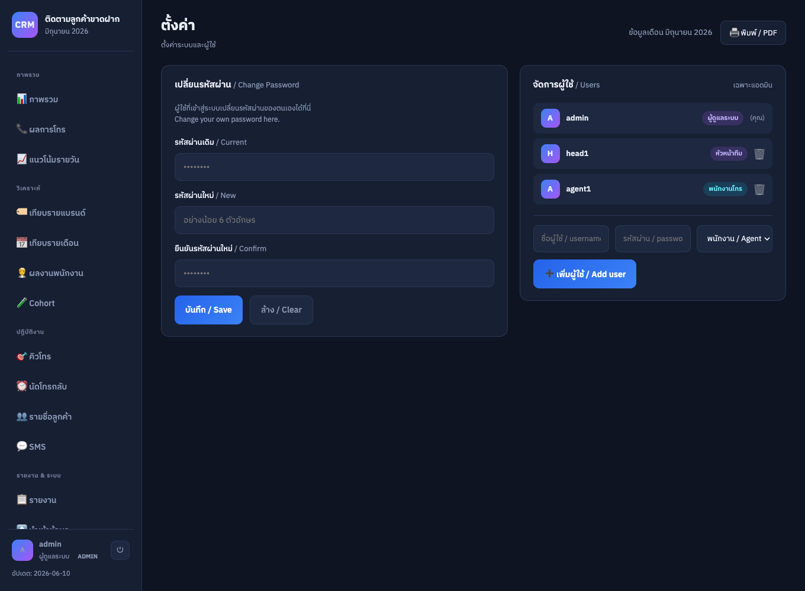
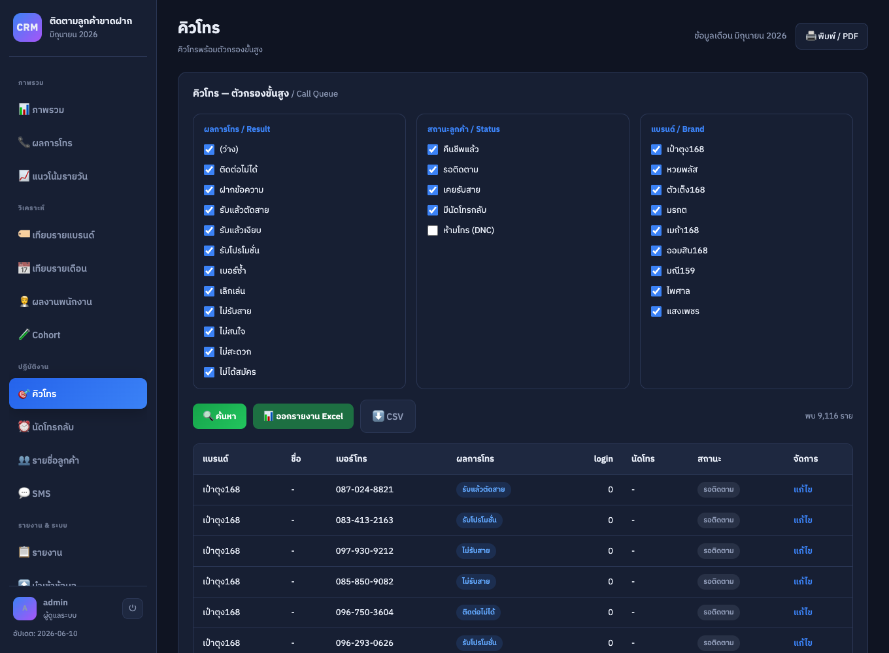
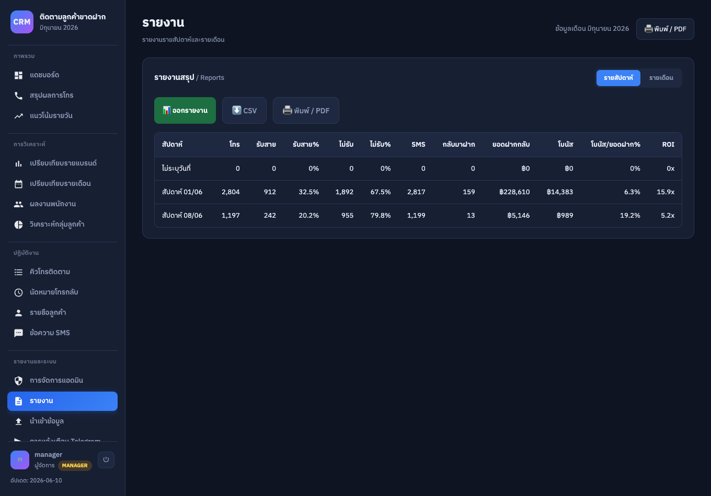
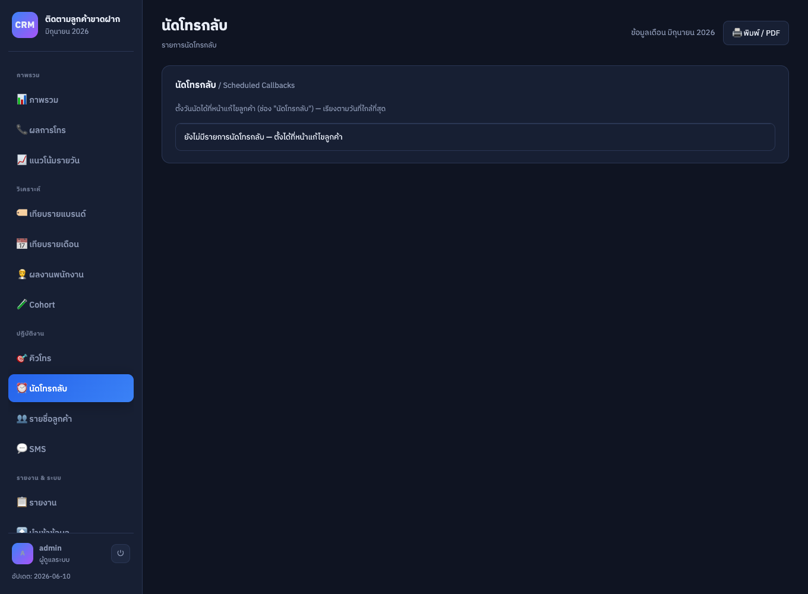
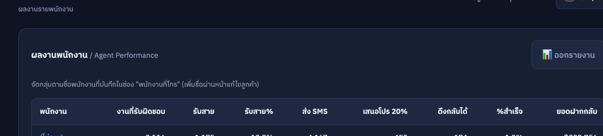
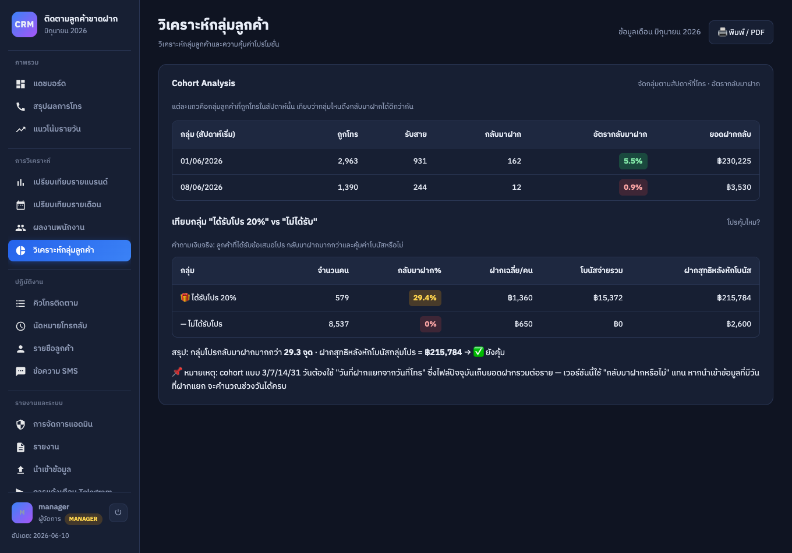
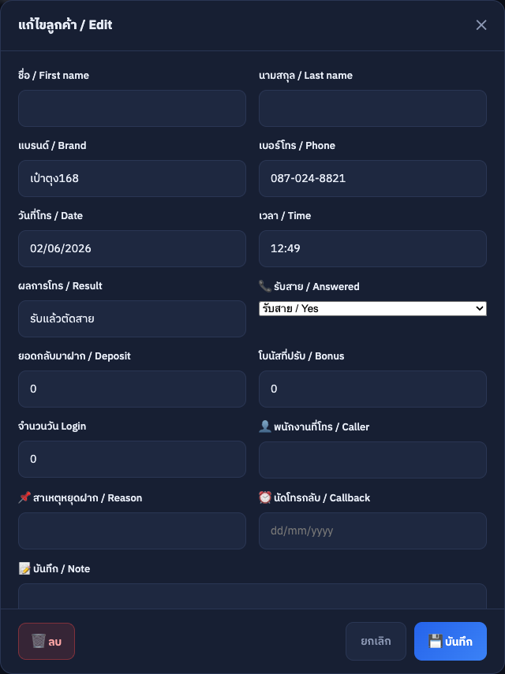
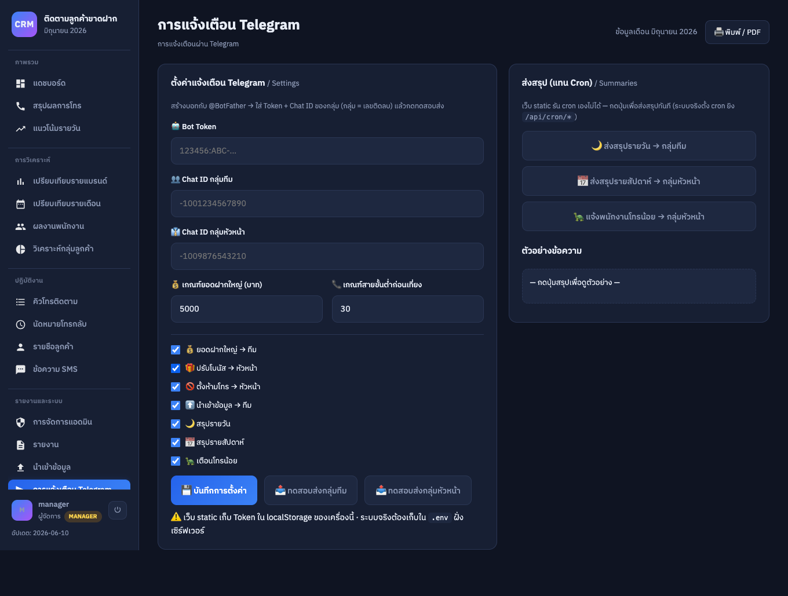
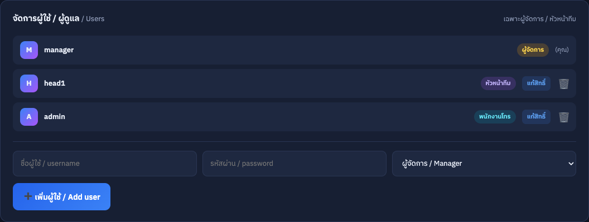
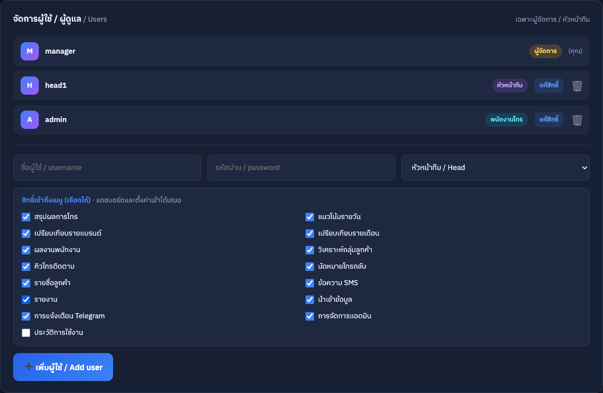

# 📦 สรุปการส่งงาน — ระบบ CRM ติดตามลูกค้า (12 ข้อ)

> ทำบนข้อมูลจริง ~7,200 ลูกค้า (ไม่ซ้ำเบอร์) · 9 แบรนด์ · ทุกข้อทดสอบแล้ว
> ผู้ใช้ทดสอบ: `manager/manager1234` (ผู้จัดการ) · `head1/head1234` (หัวหน้าทีม) · `admin/admin1234` (พนักงานโทร)
> เปิดใช้งาน: ดับเบิลคลิก `index.html` · เอกสารเต็ม: `docs/index.html`
>
> _แต่ละข้อมี **เบื้องหลัง:** อธิบายว่าทำไมถึงออกแบบแบบนี้ และกลไกจริงในโค้ดทำงานยังไง (ไม่ใช่แค่เล่าซ้ำโจทย์)_

---

## ข้อ 1 — เปลี่ยนรหัสผ่านตัวเอง
**ทำอะไร:** ผู้ใช้ที่ล็อกอินเปลี่ยนรหัสผ่านตัวเองได้ (รหัสเดิม/ใหม่/ยืนยัน) ข้อความ 2 ภาษา
**ทดสอบ:** รหัสเดิมผิด→error · ใหม่<6ตัว→error · ยืนยันไม่ตรง→error · สำเร็จ→ล็อกอินด้วยรหัสใหม่ได้
**เบื้องหลัง:** รหัสไม่ได้เก็บเป็น plaintext — ผ่านการ hash (FNV-1a 32-bit) ก่อนเก็บใน localStorage การยืนยันรหัสเดิมจึงเทียบที่ค่า hash ไม่ใช่ตัวอักษร · มีกฎกันพลาดเพิ่ม: รหัสใหม่ต้อง "ไม่ซ้ำของเดิม" และบันทึกเวลาเปลี่ยน + ลง Audit Log ทุกครั้ง เพื่อให้ผู้จัดการสอบย้อนได้ว่าใครเปลี่ยนรหัสเมื่อไหร่ (หมายเหตุ: FNV-1a เป็น hash เร็วสำหรับเดโม ระบบจริงควรย้ายไป bcrypt/argon2 ฝั่งเซิร์ฟเวอร์)

## ข้อ 2 — Export รายชื่อลูกค้าเป็น CSV
**ทำอะไร:** ส่งออกลูกค้าตามฟิลเตอร์เป็น CSV (UTF-8 BOM เปิด Excel ภาษาไทยไม่เพี้ยน, เบอร์ขึ้นต้น 0 ไม่หาย)
**ทดสอบ:** กรองแบรนด์แล้ว Export → ได้เฉพาะแบรนด์นั้น · เปิดใน Excel อ่านได้
**เบื้องหลัง:** จัดการ 2 จุดที่ CSV+Excel มักพังเสมอ — (1) ใส่ BOM `EF BB BF` นำหน้าไฟล์ Excel จึงรู้ว่าเป็น UTF-8 ภาษาไทยไม่กลายเป็นต่างดาว (2) เบอร์เก็บเป็น "ข้อความ" ตลอด ไม่เคยถูกแปลงเป็นตัวเลข เลข 0 นำหน้าจึงไม่หาย · ใส่ quote แบบ RFC 4180 เฉพาะช่องที่มี , " หรือขึ้นบรรทัดใหม่ และคอลัมน์ทั้ง 17 ตรงกับฟอร์แมตนำเข้า → export แล้ว import กลับได้ครบ (ใช้เป็นไฟล์สำรองได้เลย)

## ข้อ 3 — ตัวกรองคิวโทร
**ทำอะไร:** กรองคิวด้วย checkbox 3 กลุ่ม (ผลการโทร / สถานะลูกค้า / แบรนด์) ทำงานร่วมกัน
**ทดสอบ:** เลือก "ไม่รับสาย" + "รอติดตาม" → เห็นเฉพาะรายที่ตรงเงื่อนไข
**เบื้องหลัง:** ตรรกะเป็นแบบ "AND ระหว่างกลุ่ม, OR ภายในกลุ่ม" — เลือกหลายผลการโทรในกลุ่มเดียว = เอามาทั้งหมด (OR) แต่ต้องผ่านเงื่อนไขทุกกลุ่มถึงโผล่ (AND) ตรงกับวิธีที่คนคิดจริง ("ไม่รับสาย หรือ ติดต่อไม่ได้ และต้องเป็นแบรนด์มรกต") · "สถานะลูกค้า" ไม่ได้เก็บเป็นฟิลด์ แต่ถอดสดจากข้อมูล (มียอดฝาก>0 = คืนชีพแล้ว, มีวันนัด = มีนัด, ติ๊ก dnc = ห้ามโทร) จึงไม่ต้องให้พนักงานกรอกสถานะเอง คิวสะท้อนความจริงอัตโนมัติ

## ข้อ 4 — รายงานรายสัปดาห์/รายเดือน
**ทำอะไร:** สรุปต่อช่วงเวลา (โทร, รับสาย%, ไม่รับ%, SMS, กลับมาฝาก, ยอดฝาก, โบนัส/ยอดฝาก%, ROI) สลับสัปดาห์/เดือน
**ทดสอบ:** เทียบตัวเลขรับสาย%/ไม่รับ% ว่ารวมกันได้ 100%
**เบื้องหลัง:** จัดกลุ่มจาก "วันที่โทรจริง" ในข้อมูล ไม่ใช่วันนำเข้า — สัปดาห์ตัดแบบเริ่มวันจันทร์ (คำนวณจากเลขวันในสัปดาห์) เพื่อให้ตรงกับรอบงานของทีม ส่วนเดือนจัดด้วย key ปี-เดือน · ROI ไม่ได้เป็นตัวเลขลอยๆ แต่คือ "ยอดฝากกลับ ÷ โบนัสที่จ่าย" ตอบคำถามตรงว่าโบนัส 1 บาทดึงเงินฝากกลับมากี่บาท คุ้มหรือไม่

## ข้อ 5 — Export รายงาน (Excel)
**ทำอะไร:** ปุ่ม "ออกรายงาน" ดาวน์โหลดเป็นไฟล์ Excel เปิดได้ทั้ง Excel/Google Sheets (มีในหน้ารายงาน/คิวโทร/ผลงานพนักงาน)
**ทดสอบ:** กดออกรายงาน → เปิดไฟล์ใน Excel ตัวเลขตรงกับหน้าจอ
**เบื้องหลัง:** สร้างไฟล์ Excel โดยไม่พึ่งไลบรารีภายนอกเลย — เขียน `<table>` HTML แล้วส่งด้วย MIME `application/vnd.ms-excel` (.xls) ซึ่ง Excel/Sheets เปิดได้เนทีฟ พร้อมหัวตารางจัดสีน้ำเงิน · เลือกวิธีนี้เพราะเว็บเป็น static ล้วน เปิดจากไฟล์ได้ทันทีไม่ต้องลงอะไร · ข้อแลก: เป็น .xls แบบ HTML-table ไม่ใช่ .xlsx แท้ที่มีสูตร (ไว้ต่อยอดฝั่งเซิร์ฟเวอร์)

## ข้อ 6 — นัดหมายโทรกลับ
**ทำอะไร:** ตั้งวันนัดในหน้าแก้ไขลูกค้า → หน้า "นัดหมายโทรกลับ" รวมรายการ เรียงตามวัน + ป้ายเลย/ครบกำหนด
**ทดสอบ:** ใส่วันนัด → โผล่ในหน้านัดพร้อมป้ายสถานะ
**เบื้องหลัง:** เปลี่ยน "ช่องวันที่" ธรรมดาให้กลายเป็น "รายการงานจริง" — เรียงวันใกล้สุดขึ้นก่อน แล้วติดป้ายความเร่งด่วนด้วยสี (เลยกำหนด=แดง / ครบกำหนดวันนี้=ส้ม / ยังรอ=น้ำเงิน) · จุดที่คิดเผื่อ: เทียบกับ "วันล่าสุดในชุดข้อมูล" ไม่ใช่วันนี้จริงของเครื่อง เดโมที่รันบนข้อมูลย้อนหลังจึงยังเห็นป้ายสถานะถูกต้อง ไม่กลายเป็นเลยกำหนดทั้งหมด

## ข้อ 7 — บังคับสถานะห้ามโทร (Do-Not-Call)
**ทำอะไร:** ติ๊กห้ามโทร (บังคับกรอกเหตุผล) → ตัดออกจากคิวอัตโนมัติ + บันทึกประวัติเปลี่ยนสถานะ (ใคร/เมื่อไหร่/เหตุผล)
**ทดสอบ:** ตั้งห้ามโทร → หายจากคิว · ดูประวัติในหน้าแก้ไข
**เบื้องหลัง:** ออกแบบเชิง "ความรับผิดชอบ/compliance" — บังคับกรอกเหตุผลก่อนเซฟ (ปล่อยว่างไม่ได้) แล้วเขียนลง statusLog เป็นประวัติที่ลบทับไม่ได้ เก็บครบ ใคร/เมื่อไหร่/จากสถานะอะไรเป็นอะไร/เหตุผล จึงตอบได้เสมอว่าใครสั่งห้ามโทรเบอร์นี้และเพราะอะไร · การตัดออกจากคิวทำที่ชั้นกรองคิว (queueFiltered) อัตโนมัติ กันโทรซ้ำโดยไม่ตั้งใจ + เด้งแจ้งหัวหน้าผ่าน Telegram ได้

## ข้อ 8 — แดชบอร์ดผลงานรายพนักงาน
**ทำอะไร:** สรุปต่อพนักงาน: งาน, รับสาย%, ส่ง SMS, เสนอโปร 20%, ดึงกลับได้, %สำเร็จ, ยอดฝาก + คลิกดูรายวัน + ออกรายงาน
**ทดสอบ:** ใส่ชื่อพนักงานในลูกค้าหลายราย → เห็นสรุปรายคน
**เบื้องหลัง:** จัดกลุ่มตามชื่อ "พนักงานที่โทร" แล้ววัดผลที่ผูกกับเงินจริง — "%สำเร็จ" คือ ลูกค้าที่ดึงกลับมาฝากได้ ÷ งานที่รับผิดชอบ ไม่ใช่แค่นับจำนวนสายที่โทร จึงสะท้อนคนที่ "ปิดงานได้" ไม่ใช่แค่ "โทรเยอะ" · ซื่อตรงกับข้อมูล: ถ้ายังไม่มีการกรอกชื่อพนักงาน จะรวมเป็นกลุ่ม "(ไม่ระบุ)" ไม่สร้างชื่อปลอม พอทีมเริ่มกรอกชื่อจริงระบบแยกรายคนทันที

## ข้อ 9 — Cohort Analysis
**ทำอะไร:** จัดกลุ่มตามสัปดาห์ที่โทร + เทียบกลุ่ม "ได้รับโปร 20%" vs "ไม่ได้รับ" (กลับมาฝาก%, ฝากสุทธิหลังหักโบนัส, สรุปคุ้ม/ไม่คุ้ม)
**ทดสอบ:** ดูอัตรากลับมาฝากแต่ละกลุ่ม (สีไล่เขียว/เหลือง/แดง)
**เบื้องหลัง:** ตอบคำถามเงินที่ "อัตรากลับมาฝาก" เพียวๆ ซ่อนไว้ — เทียบกลุ่มได้โปรกับไม่ได้โปร แล้วคิด "ฝากสุทธิหลังหักโบนัส" (ยอดฝาก − โบนัสที่จ่าย) เพราะโปรอาจทำให้คนกลับมาเยอะแต่ขาดทุนหลังหักของแถม ตัวเลขสุทธินี้คือบรรทัดที่ฟ้องว่าโปรคุ้มจริงไหม · แบ่ง cohort ตามสัปดาห์ที่ถูกโทร (ตัดวันจันทร์เหมือนรายงาน) + ไล่สี heat (เขียว≥3% / ส้ม≥1.5% / แดงต่ำกว่า) ให้กวาดตาเห็นกลุ่มที่เวิร์กทันที

## ข้อ 10 — Audit Log
**ทำอะไร:** บันทึกทุกการกระทำ (เข้า/ออกระบบ, แก้ไข/เพิ่ม/ลบลูกค้า, นำเข้า, เปลี่ยนรหัส, แก้สิทธิ์, ส่ง SMS) + ค้นหา + ออกรายงาน
**ทดสอบ:** ทำกิจกรรม → ขึ้นใน log พร้อมเวลา/ผู้ใช้
**เบื้องหลัง:** ในระบบที่หลายคนใช้ร่วมกัน คำถามที่ต้องตอบได้คือ "ใครแก้/ใครลบรายการนี้" — ทุก action จึงต่อท้ายเป็น record `{เวลา, ผู้ใช้, การกระทำ, รายละเอียด}` · ค้นหาแบบ substring ไม่สนตัวพิมพ์เล็กใหญ่ครอบทุกฟิลด์ และจำกัดเพดานที่ 1000 รายการล่าสุด กัน localStorage บวมไม่จำกัด

## ข้อ 11 — คลังข้อความ SMS
**ทำอะไร:** คลังข้อความ + ตัวแปร `{{เว็บ}} {{เบอร์}} {{ชื่อ}}` + ในหน้าแก้ไขลูกค้ามีปุ่มคัดลอกข้อความรายคน (ติ๊ก "ส่ง SMS แล้ว" อัตโนมัติ)
**ทดสอบ:** เลือกข้อความ → เห็นข้อความแทนค่าของลูกค้า → กดคัดลอก
**เบื้องหลัง:** แทนค่าตัวแปร ({ชื่อ}/{เว็บ}/{เบอร์} รับทั้งรูปไทยและ {name}{brand}{phone}) เป็นรายคนก่อนส่ง และโชว์ตัวอย่างข้อความจริง + จำนวนผู้รับ เพื่อให้เห็นผลก่อนยิงเป็นชุด ลดความเสี่ยงเทมเพลตผิดหลุดออกไปทีละพันคน · จุดสำคัญด้าน compliance: การคัดกรองผู้รับ "ตัด DNC ออกทุกกลุ่ม" บังคับที่ชั้นเลือกผู้รับ เบอร์ห้ามโทรจึงไม่มีทางหลุดเข้า blast

## ข้อ 12 — แจ้งเตือนผ่านบอท Telegram
**ทำอะไร:** ตั้งค่า Token/Chat ID/เกณฑ์/เปิด-ปิดรายประเภท · แจ้งทันที (ยอดใหญ่/โบนัส/ห้ามโทร/นำเข้า) · ส่งสรุปวัน/สัปดาห์ · เบอร์ลูกค้าถูก mask
**ทดสอบ:** ใส่ Token+Chat ID → กดทดสอบส่ง → ข้อความเข้ากลุ่ม
**เบื้องหลัง:** แยกปลายทาง 2 กลุ่ม (ทีม/หัวหน้า) + toggle เปิดปิดรายประเภท เพื่อกัน "alert fatigue" คนรับเฉพาะเรื่องที่เกี่ยวกับตัว · เบอร์ลูกค้าถูก mask เป็น `081-xxx-1234` ก่อนส่งเข้ากลุ่มแชต รักษาความเป็นส่วนตัว · และสำคัญสุด: ทุกการส่งห่อด้วย try/catch — Telegram ล่มหรือ Token ผิดจะแค่ warn ไม่ทำให้การบันทึกลูกค้า/งานหลักพัง (แจ้งเตือนเป็น best-effort ไม่ใช่ critical path) · ส่วนสรุปรายวัน/สัปดาห์ใช้ปุ่มกดแทน cron เพราะ static web ไม่มีตัวตั้งเวลาฝั่งเซิร์ฟเวอร์

---

## 🔐 ระบบสิทธิ์ (เพิ่มเติมจากกติกา)
**ทำไมเพิ่มข้อนี้:** ต้องการให้ **สร้างผู้ใช้ได้หลายคน แล้วเลือกได้ว่ายูสไหนเห็นข้อมูล/เมนูข้อไหนได้บ้าง** — ไม่ใช่เปิดให้ทุกคนเห็นทุกอย่าง (โจทย์เดิมไม่ได้กำหนดเรื่องสิทธิ์ ส่วนนี้ออกแบบเพิ่มเอง)

สิทธิ์ 3 ระดับ **ผู้จัดการ > หัวหน้าทีม > พนักงานโทร** + ผู้จัดการ/หัวหน้ากำหนดได้ว่าผู้ใช้แต่ละคนเห็นเมนูไหนได้บ้าง
- **พนักงานโทร** เห็นเฉพาะงานของตัวเอง (คิวโทร/ลูกค้า/SMS — กรองตามชื่อผู้โทร)
- **หัวหน้าทีม** เพิ่มหน้ารายงาน/วิเคราะห์/นำเข้า/Telegram + สร้างพนักงานโทรได้
- **ผู้จัดการ** เห็นทุกอย่าง + Audit Log + จัดการผู้ใช้ทุกระดับ + กำหนดสิทธิ์เมนูรายคน
- **เบื้องหลัง:** ใช้ตาราง `VIEW_MIN` กำหนด "อันดับสิทธิ์ขั้นต่ำ" ของแต่ละเมนู (เช่น Audit Log = ผู้จัดการเท่านั้น) แล้วซ่อนเมนูที่เกินสิทธิ์ออก (กลุ่มเมนูที่ว่างยุบหายไปด้วย) · กำหนดรายคนทับค่า default ของบทบาทได้ผ่านตัวแก้สิทธิ์ · ระดับพนักงานโทรถูกจำกัดให้เห็นเฉพาะแถวที่ caller ตรงกับชื่อตัวเอง — ไม่ใช่แค่ซ่อนเมนู แต่กรองข้อมูลจริงด้วย

---

## ⚠️ หมายเหตุ
เวอร์ชันนี้เป็นเว็บ static (เก็บข้อมูล/ผู้ใช้ใน localStorage) เพื่อสาธิตครบทุกฟีเจอร์
ส่วน Cohort 3/7/14/31 วัน และการต่อ Telegram cron/ฐานข้อมูลกลาง ต้องต่อยอดเป็นเซิร์ฟเวอร์ + ฐานข้อมูลจริง
